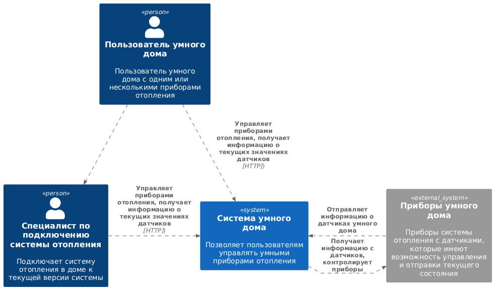
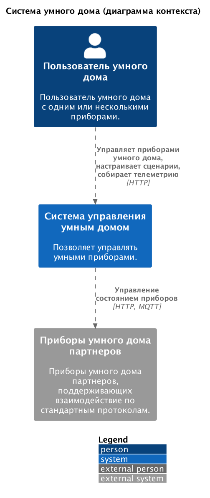
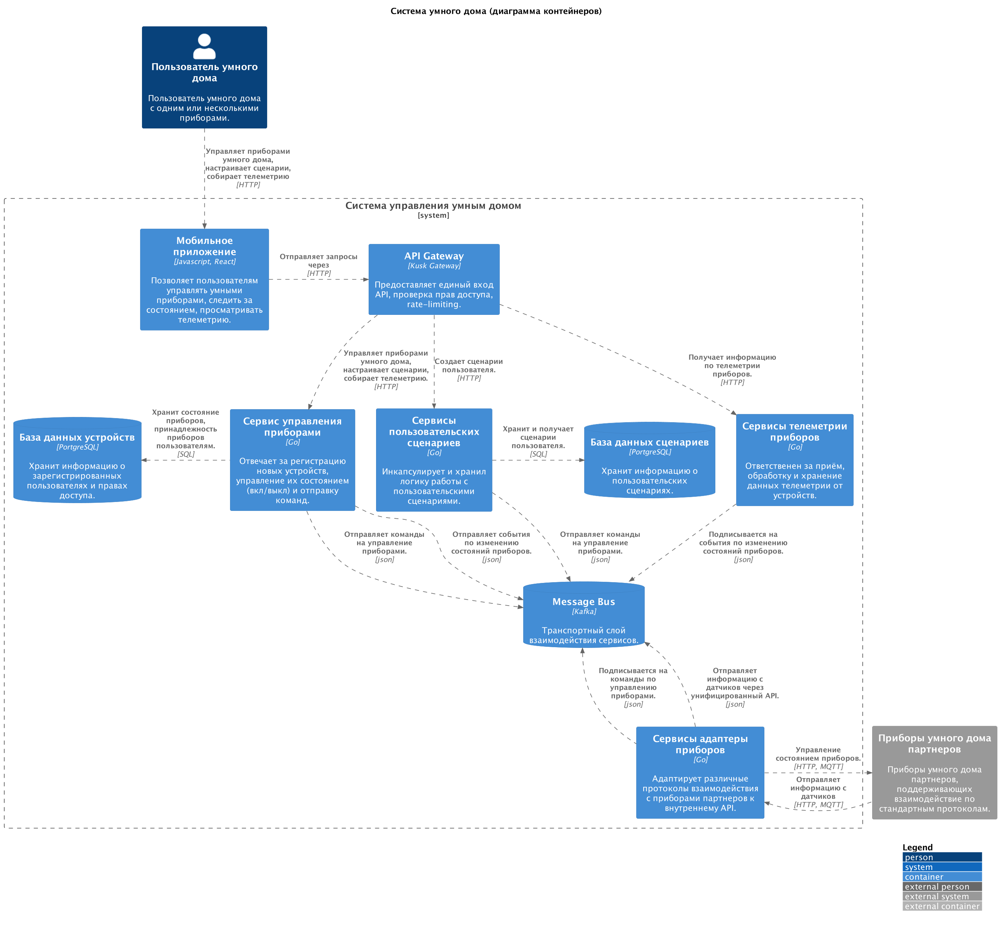
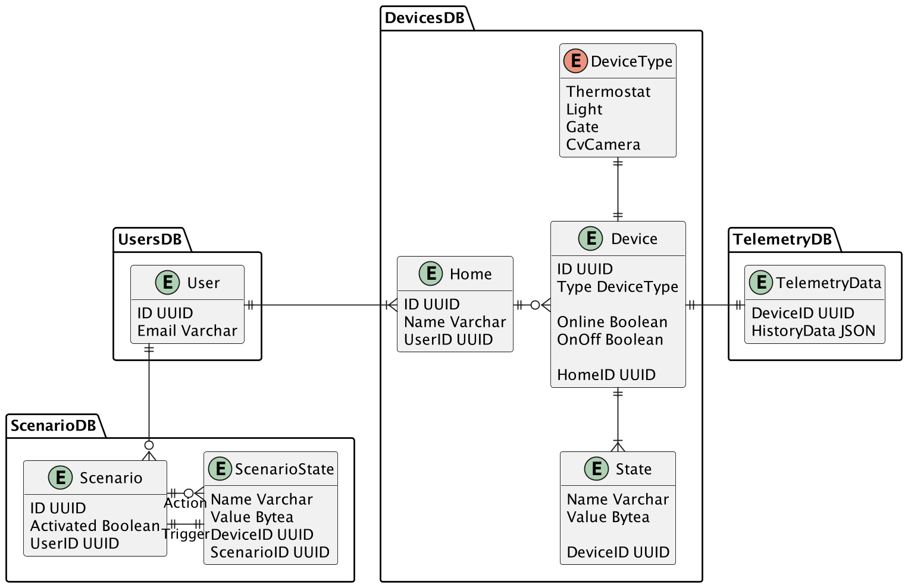

## `1.1`

### Сильные и слабые стороны:

- Монолитное приложение имеет http сервер и публикует REST API для управления умным домом.
- Сильные стороны - приложение легко запускается, анализируется, не требует продвинутой команды инфраструктуры и
  разработки, взаимодействие не усложнено множеством компонентов.
- Слабые стороны: приложение слабо масштабируется, нет возможности масштабировать отдельные элементы системы, сложно
  распределять работу над разным функционалом приложения по разным командам разработки.

### Домены и границы контекстов:

- Домен "Управление отоплением в доме":
    - Контекст "Установка умного дома"
    - Контекст "Контроль системы отопления"

### C4 System Context Diagram:

## `1.2`

## `1.3`

ER диаграмма сущностей

## `1.4`

Документация микросервисов:

- [API](api/openapi.yaml)
- [Async API](api/asyncapi.yaml)

## `2.1`

Реализацию микросервисов см. в [../microservices](../smart-home-microservices)
